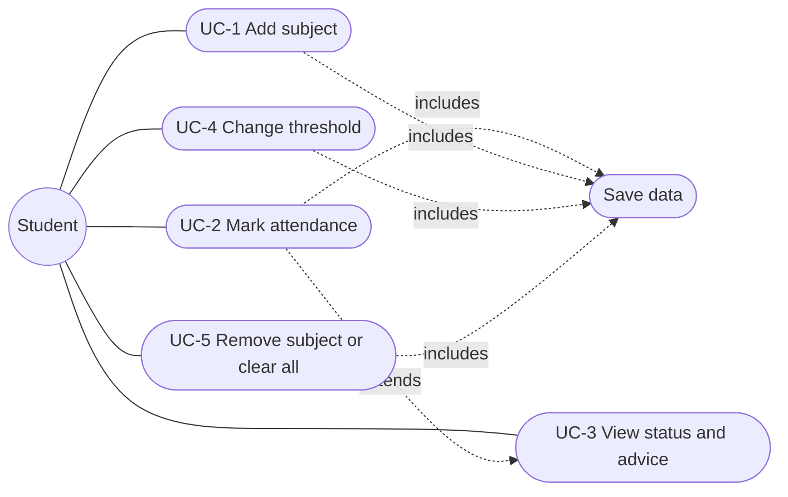
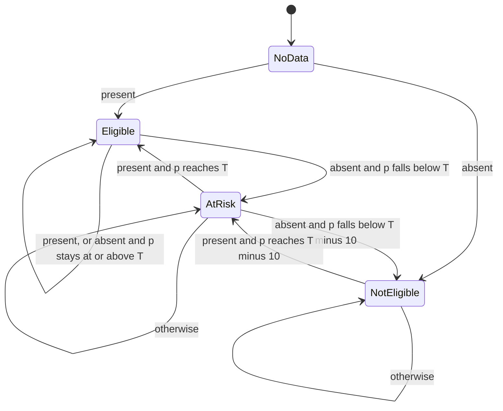

# Software Requirements Specification (SRS)

**Project:** Attendance Tracker
**Version:** 1.0
**Format:** follows the structure of IEEE 830

| Item | Value |
|---|---|
| Team | SEProject team (3 members, see README) |
| Course | Software Engineering, PBL |
| Status | Baselined for v1.0 |

---

## 1. Introduction

### 1.1 Purpose
This document specifies the requirements of the **Attendance Tracker**, a web application that lets a student record attendance subject by subject, see the current attendance percentage, and know whether they meet the minimum attendance required to sit the exams.

### 1.2 Scope
The product is a single-page website. It:

- records present/absent for each class of each subject,
- calculates the percentage per subject and overall,
- classifies the student as **Eligible**, **At risk** or **Not eligible** against a minimum percentage (default 75%),
- tells the student how many classes to attend in a row to recover, or how many they can still miss.

Out of scope for v1.0: user accounts, a server or database, multiple devices syncing, teacher/admin features, timetable import, notifications.

### 1.3 Definitions

| Term | Meaning |
|---|---|
| Threshold | Minimum attendance percentage required (default 75, adjustable 1 to 99). |
| Eligible | Percentage is at or above the threshold. |
| At risk | Percentage is below the threshold but at or above threshold minus 10. |
| Not eligible | Percentage is below threshold minus 10. |
| Subject | A course for which attendance is tracked. |

### 1.4 References
- IEEE Std 830, Recommended Practice for Software Requirements Specifications
- ISO/IEC 9126, Software product quality model (see `design.md`)

### 1.5 Overview
Section 2 describes the product in general, Section 3 lists specific requirements, Section 4 models the requirements (use cases, decision table, event table, state transition table), and Section 5 traces requirements to tests.

---

## 2. Overall description

### 2.1 Product perspective
A standalone, client-side web application. There is no back end. Data is kept in the browser's `localStorage`. The site is hosted as static files on GitHub Pages.

### 2.2 Product functions (summary)
1. Add and remove subjects.
2. Mark each class as present or absent.
3. Show percentage and eligibility per subject and overall.
4. Give advice on classes needed or classes that can be missed.
5. Change the minimum attendance rule.
6. Keep data between visits.

### 2.3 User classes

| User | Description | Technical skill |
|---|---|---|
| Student (only actor) | A college student tracking their own attendance. | Basic web use |

### 2.4 Operating environment
Any current desktop or mobile browser (Chrome, Edge, Firefox, Safari) with JavaScript and `localStorage` enabled. Screen width from 320 px.

### 2.5 Design and implementation constraints
- HTML, CSS and JavaScript only, no server.
- Must be deployable on GitHub Pages (static hosting).
- Business rules must be separate from the user interface so they can be unit tested.

### 2.6 Assumptions and dependencies
- The student enters the attendance honestly. The app does not verify it against college records.
- One browser profile equals one student. Clearing site data deletes the records.

### 2.7 Requirement elicitation
Requirements were gathered using the techniques taught in Unit IV. **Team: fill in the real findings before submission.**

| Technique | How we used it | Findings (team to complete) |
|---|---|---|
| Interviews | Ask 5 classmates how they track attendance now | TODO |
| Questionnaire | Short form: "What do you want to know about your attendance?" | TODO |
| Observation / document study | Read the college attendance rule and exam eligibility circular | TODO |
| Prototype review | Show the first version of the page to classmates | TODO |

---

## 3. Specific requirements

### 3.1 Functional requirements

| ID | Requirement | Priority |
|---|---|---|
| FR-1 | The system shall let the student add a subject by name, with optional "attended so far" and "classes held so far" counts (both default to 0). | High |
| FR-2 | The system shall reject a subject name that is empty, longer than 40 characters, or equal (ignoring case and extra spaces) to an existing subject. | High |
| FR-3 | The system shall let the student mark a class as **present** for a subject, which increases both attended and total by 1. | High |
| FR-4 | The system shall let the student mark a class as **absent** for a subject, which increases total by 1 only. | High |
| FR-5 | The system shall show each subject's attendance percentage, rounded to 2 decimals, and show 0% when no classes were held. | High |
| FR-6 | The system shall classify each subject (and the overall record) using the decision table in Section 4.2. | High |
| FR-7 | The system shall tell the student the fewest consecutive classes they must attend to reach the threshold (when below it), or the most classes they can miss and stay eligible (when at or above it). | Medium |
| FR-8 | The system shall show the overall percentage and status across all subjects. | High |
| FR-9 | The system shall let the student change the threshold to a whole number from 1 to 99, and shall use 75 by default. | Medium |
| FR-10 | The system shall let the student remove a subject after a confirmation prompt. | Medium |
| FR-11 | The system shall let the student clear all subjects after a confirmation prompt. | Low |
| FR-12 | The system shall save all data in the browser after every change and restore it when the page is opened again. | High |
| FR-13 | The system shall reject invalid numbers (negative, non-integer, attended greater than total) and show a clear error message without changing any data. | High |

### 3.2 External interface requirements

**User interface**
- One page with: overall summary and threshold box, "Add a subject" form, and one card per subject.
- Each card shows name, status badge, percentage, a progress bar with a marker at the threshold, advice text, and Present / Absent / Remove buttons.
- Errors and confirmations appear in a message line near the top.

**Hardware interfaces:** none.
**Software interfaces:** browser `localStorage` API.
**Communication interfaces:** none (no data is sent anywhere).

### 3.3 Non-functional requirements

| ID | Category (ISO 9126) | Requirement |
|---|---|---|
| NFR-1 | Usability | Marking a class takes one click. A new student can add a subject and mark attendance without instructions. |
| NFR-2 | Usability / Accessibility | All controls work with the keyboard and have text labels. Status is shown with text, not colour alone. |
| NFR-3 | Reliability | No data is lost on page reload. Corrupt or invalid saved data is ignored without crashing the page. |
| NFR-4 | Efficiency | The page updates in well under one second with at least 100 subjects and 20,000 recorded classes. |
| NFR-5 | Portability | Works on current Chrome, Edge, Firefox and Safari, and on screens from 320 px wide. |
| NFR-6 | Maintainability | Business logic lives in `js/attendance.js`, separate from the UI. Automated tests cover at least 90% of lines. |
| NFR-7 | Security and privacy | All data stays in the user's browser. User text is shown with `textContent`, never inserted as HTML, to prevent script injection. |

### 3.4 Business rules

| ID | Rule |
|---|---|
| BR-1 | Attendance % = attended / total x 100. |
| BR-2 | Default minimum is 75%. A student at exactly the threshold is Eligible. |
| BR-3 | The At risk band is the 10 percentage points below the threshold. |

---

## 4. Requirement modelling

### 4.1 Use cases

| ID | UC-1 Add subject |
|---|---|
| Actor | Student |
| Precondition | Page is open |
| Main flow | 1. Student types a subject name. 2. Optionally enters attended and held counts. 3. Clicks **Add subject**. 4. System validates, adds the card, saves, shows a confirmation. |
| Alternate flow | Invalid name or counts: system shows an error and adds nothing (FR-2, FR-13). |
| Postcondition | Subject appears with correct percentage and status. |

| ID | UC-2 Mark attendance |
|---|---|
| Actor | Student |
| Precondition | At least one subject exists |
| Main flow | 1. Student clicks **Present** or **Absent** on a subject card. 2. System updates counts, recalculates percentage, status and advice, saves. |
| Postcondition | Card and overall summary show new values. |

| ID | UC-3 View status and advice |
|---|---|
| Actor | Student |
| Main flow | System shows percentage, badge and advice on every card and in the overall summary (FR-5 to FR-8). |

| ID | UC-4 Change threshold |
|---|---|
| Actor | Student |
| Main flow | 1. Student enters a whole number 1 to 99. 2. Clicks **Update**. 3. System recalculates all statuses and saves. |
| Alternate flow | Value outside 1 to 99 or not whole: error, threshold unchanged. |

| ID | UC-5 Remove subject or clear all |
|---|---|
| Actor | Student |
| Main flow | 1. Student clicks **Remove** or **Clear all**. 2. System asks for confirmation. 3. On OK, data is deleted and saved. |
| Alternate flow | Student cancels: nothing changes. |

### 4.2 Decision table: eligibility status

Let `T` = threshold (default 75), `p` = attendance percentage.

| Rule | R1 | R2 | R3 | R4 |
|---|---|---|---|---|
| Classes held = 0 | Y | N | N | N |
| p >= T | - | Y | N | N |
| p >= T - 10 | - | - | Y | N |
| **Status** | No data | Eligible | At risk | Not eligible |

### 4.3 Event table

| Event | Trigger | System response |
|---|---|---|
| Subject added | Student submits add form | Validate, create subject, save, re-render |
| Marked present | Click Present | attended +1, total +1, save, re-render |
| Marked absent | Click Absent | total +1, save, re-render |
| Threshold changed | Submit threshold form | Validate, store, recalculate all statuses, save |
| Subject removed | Click Remove, confirm | Delete subject, save, re-render |
| All cleared | Click Clear all, confirm | Delete all, save, re-render |
| Page opened | Browser loads page | Load saved data (ignore if corrupt), render |

### 4.4 State transition table (per subject)

| Current state | Present | Absent | Threshold raised | Threshold lowered |
|---|---|---|---|---|
| No data | Eligible (100%) | Not eligible (0%) | No data | No data |
| Eligible | Eligible | Eligible, At risk or Not eligible (depends on new %) | May become At risk or Not eligible | Eligible |
| At risk | Eligible or At risk | At risk or Not eligible | At risk or Not eligible | May become Eligible |
| Not eligible | At risk or Not eligible, or better as % rises | Not eligible | Not eligible | May become At risk or Eligible |

---

## 5. Traceability matrix

| Requirement | Verified by (see `test-plan.md`) |
|---|---|
| FR-1 | TC-34, TC-36, UI-01 |
| FR-2 | TC-27, TC-28, TC-29, TC-35, UI-02 |
| FR-3 | TC-25, TC-37, UI-03 |
| FR-4 | TC-26, TC-37, UI-03 |
| FR-5 | TC-01 to TC-04, UI-03 |
| FR-6 | TC-08 to TC-18, TC-30 to TC-33 |
| FR-7 | TC-19 to TC-24 |
| FR-8 | TC-41, TC-42 |
| FR-9 | TC-16, TC-17, TC-40, UI-05 |
| FR-10 | TC-38, TC-39, UI-06 |
| FR-11 | TC-48, UI-06 |
| FR-12 | TC-43 to TC-46, UI-04 |
| FR-13 | TC-05 to TC-07, TC-18, TC-36, UI-02 |
| NFR-1, NFR-2 | UI-03, UI-08 |
| NFR-3 | TC-45, TC-46, UI-04 |
| NFR-4 | TC-49 |
| NFR-5 | UI-07 |
| NFR-6 | Coverage report in `test-plan.md` |
| NFR-7 | UI-09 |
