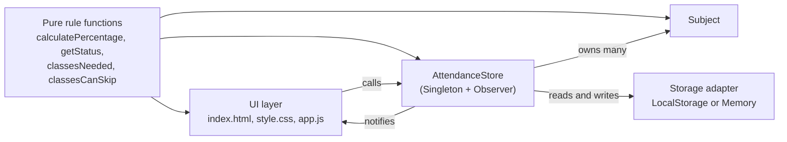
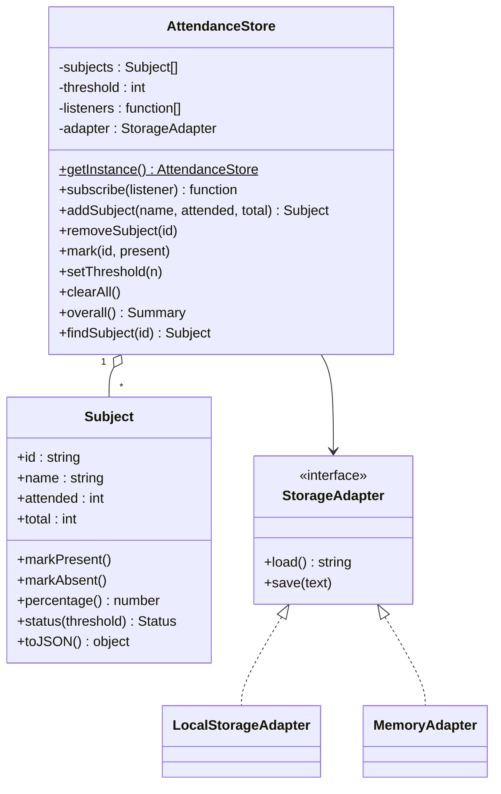
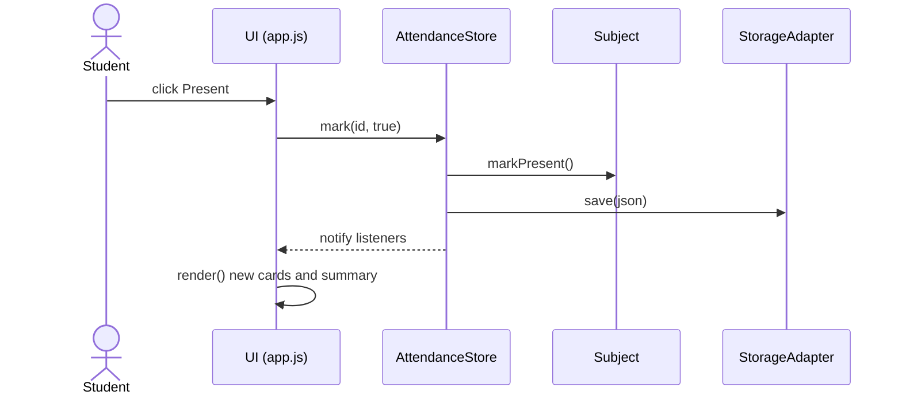

# Design Document

**Project:** Attendance Tracker

## 1. Architecture

A three-part, client-side design. The business rules know nothing about the page, so they can be tested alone.

| Layer | File | Responsibility |
|---|---|---|
| Presentation | `index.html`, `css/style.css`, `js/app.js` | Draw the page, read form input, call the store. No business rules. |
| Domain | `js/attendance.js` | Rules, `Subject`, `AttendanceStore`, storage adapters. No DOM code. |
| Tests | `tests/attendance.test.js` | Automated checks of the domain layer. |

## 2. Class diagram

## 3. CRC cards

| Class | Responsibilities | Collaborators |
|---|---|---|
| **Subject** | Hold name and counts. Record present or absent. Report its own percentage and status. Validate its own data. | Rule functions |
| **AttendanceStore** | Keep the list of subjects and the threshold. Add, remove and find subjects. Reject duplicates. Compute overall attendance. Save and load. Tell listeners about changes. | Subject, StorageAdapter, listeners (the UI) |
| **StorageAdapter** (LocalStorage / Memory) | Read and write one saved text value. | AttendanceStore |
| **UI (app.js)** | Show subjects and summary. Turn clicks and form input into store calls. Show messages. | AttendanceStore |

## 4. Sequence: mark a class present

## 5. Design principles applied

| Principle | Where it shows in the code |
|---|---|
| **Abstraction** | `Subject` hides how counts are kept behind `markPresent()`, `percentage()` and `status()`. |
| **Modularity** | Domain logic (`attendance.js`) and UI (`app.js`) are separate files with a small, clear surface. |
| **Specification** | Each rule function has one documented behaviour and input rules (see comments in `attendance.js`). |
| **Encapsulation and information hiding** | Persistence details are hidden behind the adapter. The UI never touches `localStorage` directly. Helper functions such as `validateCounts` are not exported. |
| **Abstract data type** | `Subject` and `AttendanceStore` are used only through their methods. |
| **Single responsibility** | Rules, storage and display each live in their own place. |

## 6. Design patterns

| Pattern | Use | Benefit |
|---|---|---|
| **Singleton** | `AttendanceStore.getInstance()` | The whole page shares one store, so every view sees the same data. |
| **Observer** | `store.subscribe(render)` | The UI refreshes automatically after any change. New views can subscribe without changing the store. |
| **Adapter** | `LocalStorageAdapter`, `MemoryAdapter` | Same store works in the browser and in Node tests. |

## 7. Quality model (ISO/IEC 9126)

| Characteristic | Target in this project | How it is met |
|---|---|---|
| Functionality | Correct rules, at exact boundaries | Integer comparison (no floating point error), boundary-value tests TC-09 to TC-14 |
| Reliability | No data loss, no crash on bad data | Saved after every change, corrupt data ignored (TC-45, TC-46) |
| Usability | One click to mark, clear messages | Large buttons, labelled fields, plain-language advice |
| Efficiency | Fast with large data | Volume test TC-49 |
| Maintainability | Easy to change and test | Separate layers, 49 automated tests, pure functions |
| Portability | Runs anywhere with a browser | No dependencies, responsive CSS, dark mode via `prefers-color-scheme` |

Internal and external quality: *internal* qualities (separation of layers, tests, readable code) are what the team controls; *external* qualities (usability, correctness as seen by the student) are checked in the manual UI tests.

## 8. Design measurements

Counted from the code (class size and coupling):

| Class | Methods | Notes |
|---|---|---|
| Subject | 5 | Inheritance depth 0 |
| AttendanceStore | 11 instance + 2 static | Inheritance depth 0. Coupled to 2 other classes: Subject and the storage adapter |
| LocalStorageAdapter / MemoryAdapter | 2 each | Same interface |

Code size: `attendance.js` 231 SLOC, `app.js` 147 SLOC (see `project-plan.md`). Small classes with low coupling and no deep inheritance indicate a simple, maintainable design.

## 9. Refactoring and construction notes

- Eligibility checks use **integer cross-multiplication** (`attended * 100 >= threshold * total`) instead of comparing decimal percentages, so exactly 75% is never misjudged by rounding. The tests for 74, 75 and 76 guard this. (Team: if you change this later, record the refactoring here.)
- All rule checks live in one place (`attendance.js`), so changing the At risk band means editing one constant (`WARNING_MARGIN`).
- Construction principles: validate input at the boundary, fail with clear errors, keep functions short, no global state except the single store.
- Known improvement for later: saving the whole store after each click is simple but does more work than needed for very large data; it is fine for realistic use (see TC-49).
